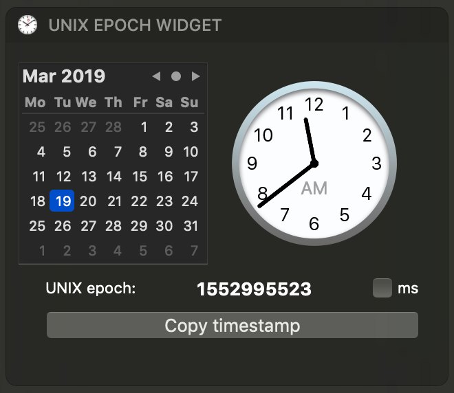

# Today UNIX epoch ⏰
Today's widget to create unix time epoch

This project has been started with **Xcode 10**, written in [**Swift 4.2**](https://swift.org/blog/swift-4-2-released/).

mac OS version target: **(10.12) mac OS Sierra**

